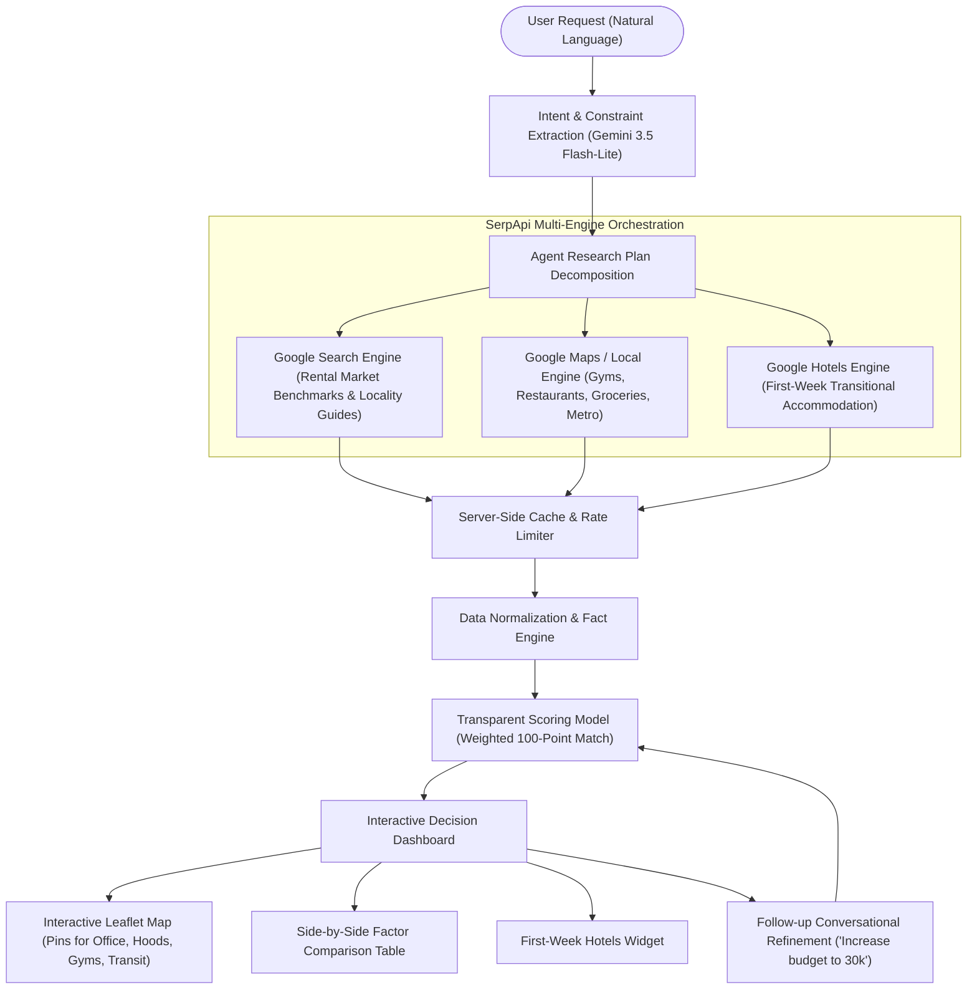

# MoveWise — Autonomous AI Relocation Agent

> **"Don't just find a place. Find where you fit."**
> 
> *An autonomous AI agent that researches unfamiliar cities on your behalf — finding where you should live based on workplace anchors, rental market realities, commute thresholds, and everyday lifestyle essentials.*

---

## 🏆 SerpApi India Hackathon 2026 — AI Agents Track

MoveWise was engineered from the ground up for the **AI Agents Track** of the SerpApi India Hackathon 2026. 

Traditional real estate platforms are glorified search boxes with filters: they force users to guess neighborhood names, browse through unverified listings, open 15 browser tabs to cross-check gym distances and supermarkets, and ignore peak-hour road gridlock.

**MoveWise replaces manual browsing with an autonomous research agent.**
You provide your natural language constraints; MoveWise breaks them into sequential research tasks, interrogates **SerpApi** across multiple engines (Google Maps / Local Places, Google Organic Search, Google Hotels), extracts verified facts, normalizes ambiguous data, scores neighborhoods with a transparent mathematical model, and produces an actionable, trade-off-aware shortlist.



---

## 🌟 Core Features

### 1. Natural Language Constraint Extraction
- Type freeform queries like:
  > *"I'm moving to Bangalore for a ₹15 LPA software job. My office is in Whitefield. My monthly housing budget is ₹25,000. I want a commute under 30 minutes and a gym within 2 km."*
- Powered by **Google Gemini** (defaulting to `gemini-3.5-flash-lite` via the official `@google/genai` SDK) with an intelligent semantic heuristic fallback when running offline or without an API key.

### 2. Autonomous Multi-Engine SerpApi Research
SerpApi makes a **material contribution** at every stage of the pipeline:
- **Google Maps / Local Engine (`google_maps`)**: Discovers verified fitness centers (Cult.fit, Gold's, Snap Fitness), dining hubs, supermarkets (Star Bazaar, Nature's Basket), and Purple Line metro stations with exact geographic distances and user ratings.
- **Google Search Engine (`google`)**: Synthesizes verified rental market ranges (1BHK/2BHK) and locality guides from real estate listings.
- **Google Hotels Engine (`google_hotels`)**: Researches first-week temporary stays near the office anchor with live nightly rates and direct booking links.

### 3. Transparent Weighted Matching Model
No black-box hallucinations. MoveWise scores each neighborhood using an explicit weighted formula:
```text
Budget fit             30%
Commute                25%
Gym proximity          15%
Food & dining          10%
Groceries & essentials 10%
Public transit / Metro 10%
```
- Each card highlights explicit **"Why this area matched"** points and honest **"Trade-offs to consider"** (e.g., peak-hour bottlenecks or water tanker reliance).
- If gym is marked optional or removed during follow-up, weights automatically redistribute proportionally.

### 4. Interactive Locality Map
- Powered by Leaflet & OpenStreetMap.
- Renders custom SVG pins for Workplace (Red), Candidate Neighborhoods (Teal with rank badges), Gyms (Purple), Restaurants (Orange), Transit (Indigo), and Hotels (Emerald).
- Clicking markers displays detailed place popups and links directly to Google Maps.

### 5. Side-by-Side Comparison Matrix
- Direct side-by-side comparison of candidate localities across:
  - 1BHK / 2BHK Estimated Rent
  - Peak vs Normal Office Commute
  - Distance to Nearest High-Rated Gym
  - Dining & Cafe Density
  - Grocery Walkability & Quick-Commerce Hubs
  - Metro Station Proximity
  - Overall Weighted Fit Score

### 6. First-Week Transitional Housing
- *"Need somewhere to stay while you search?"*
- Curated hotels near the office with guest ratings, amenities (WiFi, desk, breakfast), nightly prices, and direct booking links.

### 7. Conversational Follow-up Refinement
- Relocation plans are iterative. Users can refine parameters directly in chat:
  - *"Increase my budget to ₹30k"*
  - *"I don't care about gyms anymore"*
  - *"I want something closer to the metro"*
  - *"Show me cheaper areas"*
- The agent interprets the change, recalculates scores, and dynamically reorganizes the shortlist with a personalized explanation.

### 8. Strict "Zero Fabricated Data" Principle
- Rental listings are explicitly marked as **verified area benchmark ranges** with source citations.
- Commute times reflect transit and peak-hour road traffic caveats.
- Reviews clearly distinguish between observed community sentiment and agent analysis.

### 9. Hackathon-Safe Demo Mode
- Includes a verified snapshot dataset captured from live SerpApi queries for Bangalore's Whitefield tech corridor.
- Clearly stamped with: **`Demo data — last researched on September 2026`**.
- Ensures live presentations never fail due to Wi-Fi outages or API quota limits.

---

## 🛠️ Tech Stack

| Layer | Technology |
|---|---|
| **Framework** | Next.js 15 (App Router, Server Actions, API Routes) |
| **Language** | TypeScript (Strict mode, zero compilation errors) |
| **Styling** | Tailwind CSS with custom brand accents |
| **Icons** | Lucide React |
| **Maps** | Leaflet + OpenStreetMap (SSR-safe dynamic loader) |
| **AI / LLM** | Google Gemini (`gemini-3.5-flash-lite`) via `@google/genai` SDK |
| **External Search** | SerpApi (Google Maps, Google Search, Google Hotels) |
| **Caching** | Server-side in-memory cache with TTL and query logging |

---

## 📂 Project Structure

```
c:\Users\Pankaj\Desktop\MoveWise\
├── app/
│   ├── layout.tsx                     # Global HTML layout with Leaflet CSS
│   ├── globals.css                    # Tailwind CSS base styles & variables
│   ├── page.tsx                       # Landing page & value propositions
│   ├── plan/
│   │   └── page.tsx                   # Relocation questionnaire & agent activity tracker
│   ├── results/
│   │   └── page.tsx                   # Decision dashboard, comparison & interactive map
│   └── api/
│       ├── agent/
│       │   ├── plan/route.ts          # Constraint extraction endpoint
│       │   ├── research/route.ts      # Agent multi-task research orchestrator
│       │   └── refine/route.ts        # Conversational refinement endpoint
│       └── serpapi/
│           └── test/route.ts          # SerpApi connection test endpoint
├── components/
│   ├── navigation/
│   │   └── Navbar.tsx                 # Header with demo triggers & settings modal
│   ├── landing/
│   │   ├── Hero.tsx                   # Hero section with 1-click scenario preview
│   │   ├── HowItWorks.tsx             # 6-step loop & SerpApi spotlight
│   │   └── ValueProps.tsx             # Agent vs traditional portal comparison
│   ├── questionnaire/
│   │   ├── NaturalLanguageInput.tsx   # Freeform prompt extractor
│   │   └── StructuredForm.tsx         # Fine-grained sliders & toggles
│   ├── agent/
│   │   ├── AgentActivityPanel.tsx     # Dynamic progress tracker & query terminal
│   │   └── ReasoningAudit.tsx         # Collapsible reasoning log & telemetry
│   ├── results/
│   │   ├── SummaryHeader.tsx          # Relocation brief & demo badge
│   │   ├── NeighborhoodCard.tsx       # Rich recommendation cards with trade-offs
│   │   ├── ComparisonTable.tsx        # Side-by-side factor matrix
│   │   ├── NeighborhoodDetailModal.tsx# Verified places & review themes modal
│   │   ├── HotelsSection.tsx          # First-week stay options
│   │   ├── RefinementBar.tsx          # Conversational refinement input
│   │   └── SourceCitations.tsx        # Transparent external source links
│   ├── maps/
│   │   ├── InteractiveMap.tsx         # Leaflet map with custom SVG pins
│   │   └── MapFallback.tsx            # Clean location grid fallback
│   └── settings/
│       └── ApiKeysModal.tsx           # In-browser API key manager & Demo Mode toggle
├── lib/
│   ├── agent/
│   │   ├── planner.ts                 # Task decomposition
│   │   ├── researcher.ts              # Multi-engine execution coordinator
│   │   ├── scoring.ts                 # 100-point weighted matching model
│   │   └── recommender.ts             # Trade-offs & refinement engine
│   ├── serpapi/
│   │   ├── client.ts                  # Server-side HTTP client with caching & error handling
│   │   ├── local.ts                   # Google Maps / Local places queries
│   │   ├── search.ts                  # Google Search rent & locality queries
│   │   ├── hotels.ts                  # Google Hotels temporary stay queries
│   │   └── demoData.ts                # Verified Bangalore Whitefield snapshot
│   ├── llm/
│   │   └── client.ts                  # Gemini 3.5 Flash-Lite integration & heuristic fallback
│   └── utils.ts                       # Currency and distance formatters
├── types/
│   └── relocation.ts                  # Shared TypeScript data models
├── .env.example                       # Environment template
├── package.json
├── tsconfig.json
└── tailwind.config.ts
```

---

## 🚀 Getting Started

### Prerequisites
- Node.js >= 18 (Tested on Node.js v24)
- npm or pnpm

### 1. Clone & Install Dependencies
```bash
git clone https://github.com/your-username/MoveWise.git
cd MoveWise
npm install
```

### 2. Configure Environment Variables
Copy `.env.example` to `.env.local`:
```bash
cp .env.example .env.local
```

Fill in your API keys (optional: MoveWise runs out-of-the-box in Demo Mode without any keys):
```env
# SerpApi API Key (for live Google Maps, Search, and Hotels research)
SERPAPI_KEY=your_serpapi_key_here

# Google Gemini API Key (default LLM model: gemini-3.5-flash-lite)
GEMINI_API_KEY=your_gemini_api_key_here

# Optional: Gemini model override
GEMINI_MODEL=gemini-3.5-flash-lite
```

> **Note:** API keys can also be configured interactively from the web UI by clicking the **Settings (gear icon)** in the top right navigation bar. Keys are stored locally in your browser session and never committed or shared.

### 3. Run Locally
```bash
# Development mode
npm run dev

# Or production build & start
npm run build
npm run start
```
Open **[http://localhost:3000](http://localhost:3000)** in your browser.

---

## 🎬 3-Minute Hackathon Demo Script

Follow this scripted flow for a pitch or demo:

| Time | Action | What to Highlight |
|---|---|---|
| **0:00 - 0:20** | Open `http://localhost:3000` | Show the landing page copy: *"Don't just find a place. Find where you fit."* Explain that MoveWise is an autonomous agent, not a static search filter. |
| **0:20 - 0:40** | Click **"Try Demo (Bangalore Scenario)"** or type the natural language prompt | Show how Gemini 3.5 Flash-Lite extracts `City: Bangalore`, `Office: Whitefield`, `Budget: ₹25,000`, `Commute: <30m`, `Gym: <2km`. |
| **0:40 - 1:15** | Click **"Launch MoveWise Agent"** | Watch the **Agent Activity Panel** animate through 9 distinct tasks (Understanding requirements → Finding candidate areas → Querying SerpApi for rent benchmarks → Scanning Google Maps for Cult.fit / Gold's Gym → Checking Purple Line metro stops → Sourcing hotels → Scoring). |
| **1:15 - 1:45** | Review Recommended Neighborhoods | Point out the top recommendations: **Kundalahalli Colony**, **Kadugodi**, **Hoodi**, **Nallurhalli**, **Brookefield**. Highlight the transparent score breakdowns, verified rent ranges, and honest trade-offs. |
| **1:45 - 2:10** | Explore Map & Places Modal | Click a neighborhood card to center the interactive Leaflet map. Click **"Explore Verified Places & Reviews"** to view real Google Maps ratings for gyms and cafes, alongside community sentiment themes (👍 vs ⚠️). |
| **2:10 - 2:30** | Inspect Comparison Matrix & First-Week Hotels | Show the side-by-side factor matrix. Show the **"Need somewhere to stay while you search?"** hotel recommendations with nightly rates and direct links. |
| **2:30 - 2:50** | Conversational Refinement | In the follow-up chat, click **"Increase my budget to ₹30k"** or **"I don't care about gyms anymore"**. Watch the agent recalculate the rankings and explain how the recommendation adjusted in real time. |
| **2:50 - 3:00** | Open Sources & Reasoning Audit | Expand **"How MoveWise Researched This"** to show the query telemetry (SerpApi calls, ground truth verification, latency, zero hallucinations). |

---

## ⚖️ Limitations & Data Principles

1. **Estimated Rent Ranges**: MoveWise displays verified median market ranges synthesized from public real estate listings. Because specific rental agreements depend on landlord negotiations and lease dates, MoveWise never invents false unit-level pricing.
2. **Commute Feasibility**: Commute estimates account for normal vs peak-hour congestion corridors (such as Kundalahalli Gate or Borewell Road) rather than assuming ideal speed limits.
3. **Review Attribution**: Community sentiment is categorized into observed themes (👍 Pro, ⚠️ Trade-off) from verified place reviews.

---

## 📜 License

Created for the **SerpApi India Hackathon 2026**. Licensed under the Apache-2.0 License.
