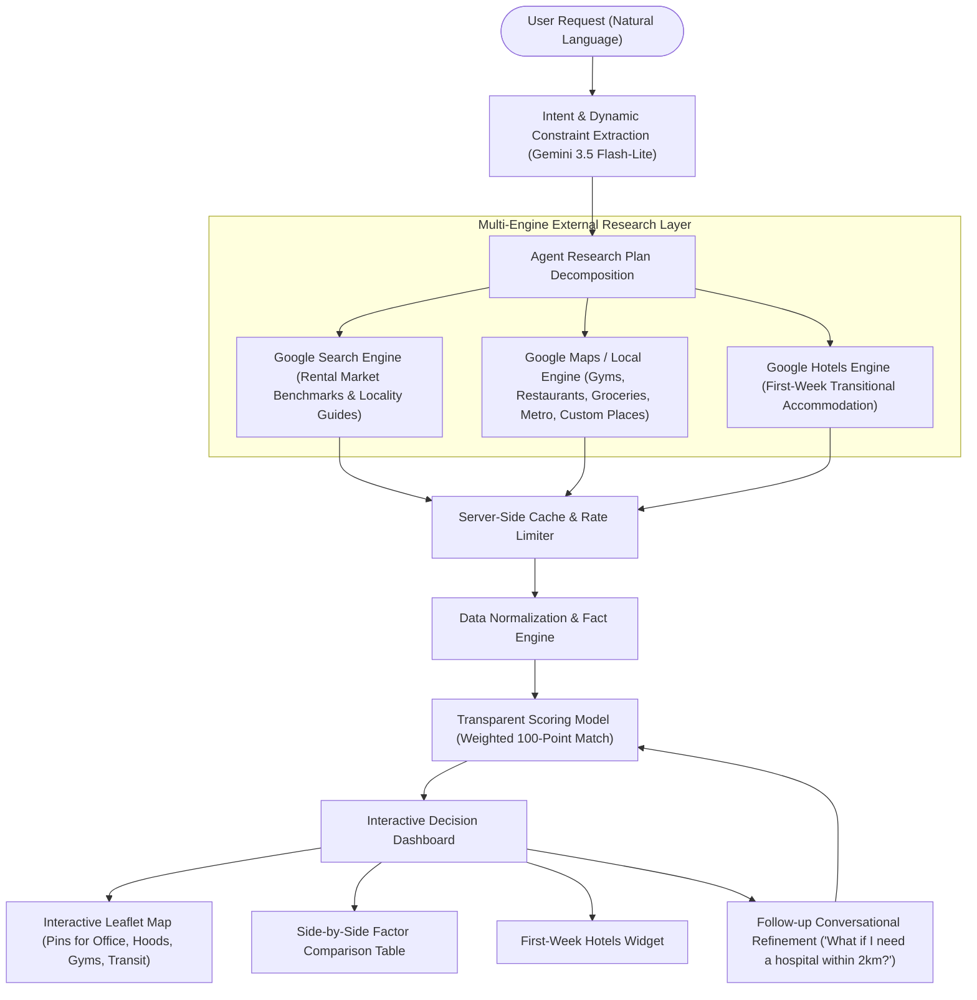

# MoveWise — Autonomous AI Relocation Agent

> **"Don't just find a place. Find where you fit."**
> 
> *MoveWise is an autonomous AI agent that researches unfamiliar cities on your behalf — finding where you should live based on workplace anchors, rental market realities, commute thresholds, and everyday lifestyle essentials.*

---

## 🧭 Overview

Traditional real estate platforms are glorified search boxes with filters: they force users to guess neighborhood names, browse through unverified listings, open 15 browser tabs to cross-check gym distances and supermarkets, and ignore peak-hour road gridlock.

**MoveWise replaces manual browsing with an autonomous research agent.**

You describe your relocation goals and constraints in natural language; MoveWise breaks them into sequential research tasks, interrogates multi-engine real-time search providers (Google Maps / Local Places, Google Organic Search, Google Hotels), extracts verified facts, normalizes ambiguous data, scores neighborhoods with a transparent mathematical model, and produces an actionable, trade-off-aware shortlist.



---

## 🌟 Core Capabilities

### 1. Dynamic Parameter Generation & Freeform Extraction
Users aren't constrained by rigid forms or fixed drop-downs. Type freeform prompts such as:
> *"I'm moving to Bangalore for a ₹15 LPA software job. My office is in Whitefield. My monthly housing budget is ₹25,000. I want a commute under 30 minutes, a gym within 2 km, and a school nearby 1 km."*

- **Arbitrary Custom Requirements**: Extracts any custom lifestyle constraint (schools, hospitals, daycares, pet parks, coworking spaces, sports facilities) with target radii (e.g. `1km`, `2km`).
- **Gemini 3.5 Flash-Lite by Default**: Uses the official `@google/genai` SDK with `gemini-3.5-flash-lite`, accompanied by a robust semantic parser fallback.

### 2. Multi-City & Locality Generalization
MoveWise is not bound to a single city. It dynamically maps candidate localities, coordinates, commute corridors, and rent ranges for any target workplace:
- **Major Tech Hubs Supported**: Bangalore (Whitefield, Bellandur, Electronic City), Hyderabad (Hitec City, Gachibowli), Pune (Hinjawadi, Baner), Mumbai (BKC, Powai), Gurgaon/Delhi-NCR (Cyber City, Golf Course Road), Chennai (OMR), and global cities.
- **Dynamic Centroid Mapping**: Interactive Leaflet maps automatically compute the centroid across discovered neighborhoods and display tailored pins for any location.

### 3. Multi-Engine Autonomous Research
- **Google Maps / Local Engine (`google_maps`)**: Discovers verified fitness centers (Cult.fit, Gold's Gym, Snap Fitness), dining hubs, supermarkets (Star Bazaar, Nature's Basket), metro stations, and custom places (e.g., *The Deens Academy*, *Manipal Hospital*) with exact distances and ratings.
- **Google Search Engine (`google`)**: Synthesizes verified rental market ranges (1BHK/2BHK) and locality guides from real estate listings.
- **Google Hotels Engine (`google_hotels`)**: Researches first-week temporary stays near the office anchor with live nightly rates, check-in dates, and direct booking links.

### 4. Transparent Weighted Matching Model
MoveWise eliminates black-box hallucinations by scoring every candidate neighborhood on a 100-point scale:
```text
Budget fit             30% base
Commute                25% base
Gym proximity          15% base
Food & dining          10% base
Groceries & essentials 10% base
Public transit / Metro 10% base
Custom constraints     Dynamically allocated (10–15% each, proportionally normalized)
```
- Each neighborhood card highlights **"Why this area matched"** checklists, dynamic distance compliance badges (`✓ School: within your 1 km limit (0.8 km away)`), and honest **"Trade-offs to consider"** (peak traffic bottlenecks, water supply reliance, etc.).

### 5. Interactive Locality Map
- Powered by Leaflet & OpenStreetMap.
- Features custom SVG pins for Workplace (Red), Candidate Neighborhoods (Teal with rank badges), Gyms (Purple), Restaurants (Orange), Transit (Indigo), and Hotels (Emerald).
- Clicking markers displays detailed place popups and links directly to Google Maps.

### 6. Side-by-Side Comparison Matrix
- Direct side-by-side comparison of candidate localities across:
  - 1BHK / 2BHK Estimated Rent
  - Peak vs Normal Office Commute
  - Distance to Nearest High-Rated Gym
  - Dining & Cafe Density
  - Grocery Walkability & Quick-Commerce Hubs
  - Metro Station Proximity
  - Custom Amenities (Schools, Hospitals, Daycares compliance)
  - Overall Weighted Fit Score

### 7. First-Week Transitional Housing
- *"Need somewhere to stay while you search?"*
- Curated hotels near the office with guest ratings, amenities (WiFi, desk, breakfast), nightly prices, and direct booking links.

### 8. Conversational Follow-Up Refinement
Relocation decisions evolve. Users can talk to MoveWise to adjust their requirements on the fly:
- *"What if I also need a hospital within 2km?"*
- *"Increase my monthly budget to ₹30,000"*
- *"I don't care about gyms anymore"*
- *"I want something closer to the metro"*
- *"Remove the school requirement"*

The agent parses the change, updates custom factors, re-attaches verified amenities, recalculates match scores, and reorganizes the shortlist with a clear explanation of how the recommendation adapted.

### 9. Strict "Zero Fabricated Data" Principle
- Rental listings are explicitly presented as **verified area benchmark ranges** with source citations.
- Commute times reflect transit and peak-hour road traffic caveats.
- Reviews clearly distinguish between observed community sentiment and agent analysis.

---

## 🛠️ Tech Stack

| Layer | Technology |
|---|---|
| **Framework** | Next.js 15 (App Router, Server Actions, Route Handlers) |
| **Language** | TypeScript (Strict mode, 100% type-checked) |
| **Styling** | Tailwind CSS with custom theme variables |
| **Icons** | Lucide React |
| **Maps** | Leaflet + OpenStreetMap (SSR-safe client hydration) |
| **AI / LLM** | Google Gemini (`gemini-3.5-flash-lite`) via `@google/genai` SDK |
| **External Search** | SerpApi (Google Maps, Google Search, Google Hotels) |
| **Caching** | Server-side in-memory cache with TTL and query logging |

---

## 📂 Project Structure

```
MoveWise/
├── app/
│   ├── layout.tsx                     # Global HTML layout with Leaflet CSS
│   ├── globals.css                    # Tailwind CSS base styles & variables
│   ├── page.tsx                       # Landing page & value propositions
│   ├── plan/
│   │   └── page.tsx                   # Relocation questionnaire & agent activity tracker
│   ├── results/
│   │   └── page.tsx                   # Decision dashboard, comparison & interactive map
│   └── api/
│       ├── agent/
│       │   ├── plan/route.ts          # Constraint extraction endpoint
│       │   ├── research/route.ts      # Agent multi-task research orchestrator
│       │   └── refine/route.ts        # Conversational refinement endpoint
│       └── serpapi/
│           └── test/route.ts          # SerpApi connection test endpoint
├── components/
│   ├── navigation/
│   │   └── Navbar.tsx                 # Header with navigation & settings modal
│   ├── landing/
│   │   ├── Hero.tsx                   # Hero section with interactive prompt preview
│   │   ├── HowItWorks.tsx             # 6-step loop & research spotlight
│   │   └── ValueProps.tsx             # Agent vs traditional portal comparison
│   ├── questionnaire/
│   │   ├── NaturalLanguageInput.tsx   # Freeform prompt extractor
│   │   └── StructuredForm.tsx         # Interactive sliders, toggles & dynamic custom requirements
│   ├── agent/
│   │   ├── AgentActivityPanel.tsx     # Dynamic progress tracker & query terminal
│   │   └── ReasoningAudit.tsx         # Collapsible reasoning log & telemetry
│   ├── results/
│   │   ├── SummaryHeader.tsx          # Relocation brief & constraints summary
│   │   ├── NeighborhoodCard.tsx       # Recommendation cards with trade-offs & custom badges
│   │   ├── ComparisonTable.tsx        # Side-by-side factor matrix including custom criteria
│   │   ├── NeighborhoodDetailModal.tsx# Verified places & review themes modal
│   │   ├── HotelsSection.tsx          # First-week stay options
│   │   ├── RefinementBar.tsx          # Conversational refinement input
│   │   └── SourceCitations.tsx        # Transparent external source links
│   ├── maps/
│   │   ├── InteractiveMap.tsx         # Leaflet map with custom SVG pins & auto-centering
│   │   └── MapFallback.tsx            # Clean location grid fallback
│   └── settings/
│       └── ApiKeysModal.tsx           # In-browser API key manager & Demo Mode toggle
├── lib/
│   ├── agent/
│   │   ├── planner.ts                 # Task decomposition & dynamic requirement planning
│   │   ├── researcher.ts              # Multi-engine execution coordinator
│   │   ├── scoring.ts                 # 100-point weighted matching model & dynamic rebalancing
│   │   ├── generator.ts               # Multi-city locality synthesis & custom place attachment
│   │   └── recommender.ts             # Conversational follow-up & refinement engine
│   ├── serpapi/
│   │   ├── client.ts                  # Server-side HTTP client with caching & error handling
│   │   ├── local.ts                   # Google Maps / Local places queries
│   │   ├── search.ts                  # Google Search rent & locality queries
│   │   ├── hotels.ts                  # Google Hotels temporary stay queries
│   │   └── demoData.ts                # Verified locality snapshots & presets
│   ├── llm/
│   │   └── client.ts                  # Gemini 3.5 Flash-Lite integration & dynamic heuristic parser
│   └── utils.ts                       # Currency and distance formatters
├── types/
│   └── relocation.ts                  # Shared TypeScript data models
├── .env.example                       # Environment template
├── package.json
├── tsconfig.json
└── tailwind.config.ts
```

---

## 🚀 Getting Started

### Prerequisites
- Node.js >= 18 (Tested on Node.js v24)
- npm or pnpm

### 1. Clone & Install Dependencies
```bash
git clone https://github.com/<your-username>/MoveWise.git
cd MoveWise
npm install
```

### 2. Configure Environment Variables
Copy `.env.example` to `.env.local`:
```bash
cp .env.example .env.local
```

Fill in your API keys (optional: MoveWise runs out-of-the-box with pre-seeded locality indices without any keys):
```env
# SerpApi API Key (for live Google Maps, Search, and Hotels research)
SERPAPI_KEY=your_serpapi_key_here

# Google Gemini API Key (default LLM model: gemini-3.5-flash-lite)
GEMINI_API_KEY=your_gemini_api_key_here

# Optional: Gemini model override
GEMINI_MODEL=gemini-3.5-flash-lite
```

> **Tip:** API keys can also be entered interactively from the web UI by clicking the **Settings (gear icon)** in the top navigation bar. Keys are stored locally in your browser session and never sent to external servers or committed to git.

### 3. Run Locally
```bash
# Development server
npm run dev

# Or production build & start
npm run build
npm run start
```
Open **[http://localhost:3000](http://localhost:3000)** in your browser.

---

## 🎬 Application Walkthrough & User Flow

1. **Homepage (`/`)**:
   - Understand the core premise: *"Don't just find a place. Find where you fit."*
   - Review the comparison of autonomous agent research vs manual portal browsing.
2. **Relocation Questionnaire (`/plan`)**:
   - Provide a natural language prompt or click an example scenario.
   - Adjust fine-tuning controls: monthly housing budget, commute thresholds, transit preferences, and add custom requirements (+ School, + Hospital, + Daycare, + Pet Park, + Coworking, + Sports).
   - Click **"Launch MoveWise Agent →"** to watch the autonomous research pipeline execute in real-time.
3. **Decision Dashboard (`/results`)**:
   - Review ranked neighborhood cards with overall match scores (0–100), transparent breakdown bars, and custom amenity badges.
   - Explore the **Interactive Leaflet Map** rendering pins for Workplace, Neighborhoods, Gyms, Restaurants, Transit, and Hotels.
   - Examine the **Side-by-Side Comparison Matrix** for multi-factor evaluation.
   - Click **"Explore Verified Places & Reviews"** to inspect star ratings, verified addresses, and community sentiment (pros vs trade-offs).
   - Browse **First-Week Temporary Hotels** with prices and direct booking links.
4. **Conversational Refinement**:
   - Use the bottom refinement bar to adjust your search in plain English (*"What if I also need a hospital within 2km?"* or *"Increase my budget to ₹30,000"*).
   - Watch the agent update criteria, re-evaluate custom place distances, and re-rank candidate neighborhoods dynamically.

---

## ⚖️ Data Integrity & Principles

1. **Estimated Rent Ranges**: MoveWise displays verified median market ranges synthesized from real estate listing trends. MoveWise never invents false unit-level pricing.
2. **Realistic Commute Estimates**: Commute estimates account for normal vs peak-hour congestion corridors rather than assuming ideal speed limits.
3. **Review Attribution**: Community sentiment is categorized into observed themes (👍 Pro, ⚠️ Trade-off) from verified place reviews.
4. **Privacy First**: API keys configured via the UI remain strictly inside your browser session.

---

## 📜 License

Licensed under the [MIT License](LICENSE).
